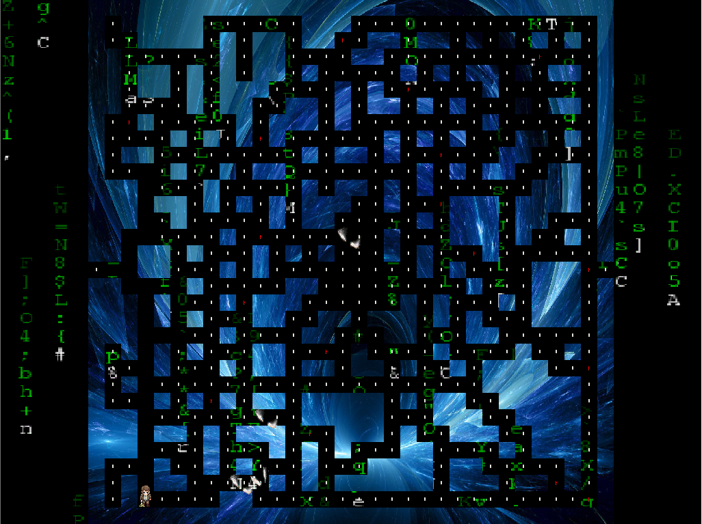

# Pacman Imitation

Imitation of the classic Pacman game using Windows GDI programming.

Images and music are from the Internet, for study purpose only.

Video Demo: [Vimeo](https://vimeo.com/435252381)

Executable File Download: [Google Drive](https://drive.google.com/drive/folders/1VnfHX6scVYMY9ZNhQZWBjdAUHe0yd8Pv?usp=sharing)

Features:
- Core mechanic imitation: four ghosts have their individual chasing strategy
- Core mechanic imitation: player becomes powerful after eating the magic pean
- Randomly generated map layout, but with reasonable difficulty in mind as well
- Applied A\* pathfinding algorithm in ghosts' chasing behavior

Know issues:
- Need a scoreboard.
- Long loading time. Need a loading image displayed.
- Bug: Player would stuck in the re-born process, if he died at the ghosts' spawn area.
- Need to refine the pathfinding algorthim in ghosts' escaping behavior.
- Need actions after the game is beaten.

---

# 仿制吃豆人

使用Windows GDI编程，仿制经典的吃豆人游戏。

图片和音乐源自网络，仅供学习使用。

演示视频：[BiliBili](https://www.bilibili.com/video/BV1HK4y1s7vp/)

可执行文件下载：[蓝奏云](https://wws.lanzous.com/iHoEdeaq3eh)

特色：
- 核心机制模仿：四个小鬼有各自的追击策略
- 核心机制模仿：玩家吃到魔法豆后，能力增强
- 地图路径是随机生成的，同时也考虑了合适的难度
- 使用A\*算法驱动小鬼的追击行为

已知问题：
- 需要计分板。
- 加载时间过长。需要显示一个加载中的图片。
- Bug： 如果玩家死在了小鬼的出生点，那么玩家会卡在重生的循环。
- 需要完善小鬼逃跑时的寻路行为。
- 玩家通关后游戏没有反应。